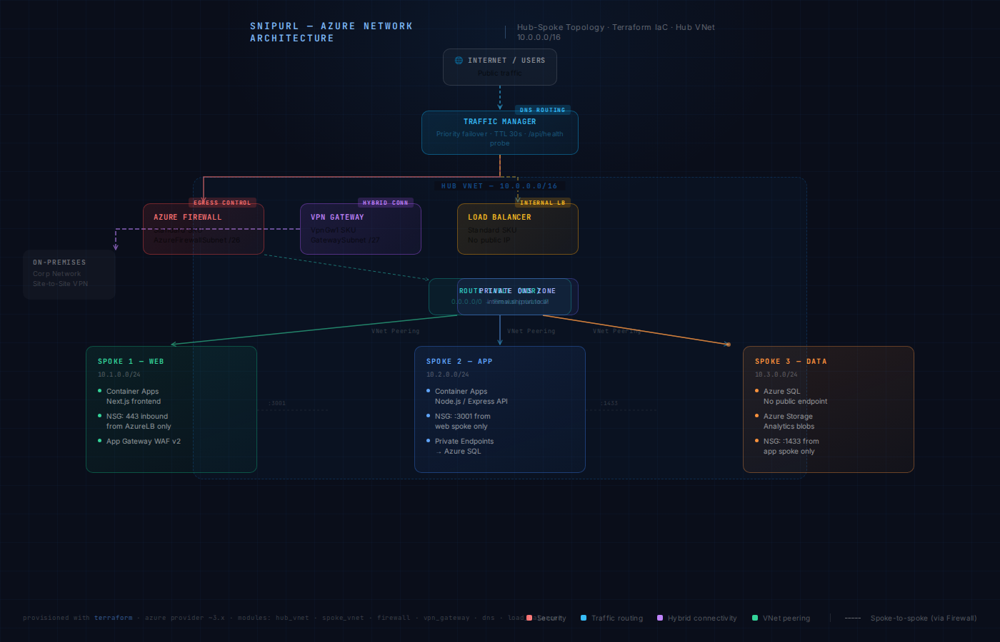

# SnipURL — URL Shortener on Azure Hub-Spoke Network

> A production-grade URL shortener built with Next.js, Node.js, and deployed on a
> fully private Azure hub-spoke network infrastructure provisioned entirely with Terraform.

[](https://github.com/usr-0123/snipurl/actions/workflows/ci.yml)
[](https://github.com/usr-0123/snipurl/actions/workflows/deploy.yml)
[](./LICENSE)

---

## Live Demo

🔗 **[snipurl.yourdomain.com](https://snipurl.yourdomain.com)** — try shortening a URL

> The demo runs on a single-region dev environment to keep costs minimal.
> The production Terraform config supports multi-region with Traffic Manager failover.

---

## What It Does

| Feature | Detail |
|---|---|
| Shorten any URL | Generates a 6-char slug, stores in Azure SQL |
| Redirect | `GET /:slug` resolves and 301-redirects in <20ms |
| Analytics dashboard | Click counts, referrers, geographic hits |
| Admin panel | Manage links, view top slugs, delete entries |
| API | REST API — `POST /api/links`, `GET /api/links/:slug/stats` |

---

## Architecture



### Network topology

The app runs on a **hub-spoke VNet topology** — all services live in private subnets
with no direct public internet access. Inbound traffic enters through Azure Application
Gateway (WAF-enabled). All egress goes through Azure Firewall.

```
Internet
    │
    ▼
Traffic Manager (DNS-based geo-routing, priority failover)
    │
    ▼
Application Gateway (public IP, WAF v2, TLS termination)
    │  [Hub VNet 10.0.0.0/16]
    ├── Azure Firewall (AzureFirewallSubnet) — all egress filtered
    ├── VPN Gateway (GatewaySubnet) — simulated on-prem connection
    ├── Internal Load Balancer — distributes to app spoke
    └── Private DNS Zone (internal.snipurl.local)
         │
         ├── Spoke 1 — Web (10.1.0.0/24)
         │   └── Container Apps: Next.js frontend
         │
         ├── Spoke 2 — App (10.2.0.0/24)
         │   └── Container Apps: Node.js API
         │   └── Private Endpoint → Azure SQL
         │
         └── Spoke 3 — Data (10.3.0.0/24)
             └── Azure SQL (no public endpoint)
             └── Azure Storage (analytics blobs)
```

### Why hub-spoke?

- **Centralised security:** Firewall and VPN Gateway live in the hub once, not duplicated per spoke. Policy changes apply everywhere.
- **Blast radius isolation:** A misconfigured NSG in the web spoke cannot affect the data spoke — they have no peering with each other, only with the hub.
- **Scale:** Adding a fourth spoke (e.g. a queue processor) means one new VNet peering — no changes to firewall or DNS.

---

## Design Decisions

**1. Azure Container Apps over AKS**
AKS gives more control but costs ~$150/month minimum and requires cluster management.
Container Apps runs on a managed control plane — I get private VNet injection, scaling to
zero, and managed TLS without babysitting nodes. Right tradeoff for a portfolio project.

**2. Traffic Manager with Priority routing, not Performance**
Performance routing sends users to the lowest-latency endpoint. Priority routing sends all
traffic to a primary endpoint and only fails over when it fails health checks. This is
cheaper (one active environment) and easier to demo — you can kill the primary and watch
DNS resolve to the secondary in real time.

**3. Azure SQL over CosmosDB**
A URL shortener's data model is relational (links → clicks → sessions). CosmosDB is
a great fit for document workloads but adds complexity (partition keys, RUs) without
benefit here. Azure SQL with Private Endpoint gives the same network security story
with a simpler data model.

**4. Terraform workspaces per environment, not per-region modules**
Each environment (dev, prod) is a Terraform workspace pointing at the same root module
with different `.tfvars`. This avoids copy-paste between regions and makes it obvious
what changes between dev and prod — just the variable overrides.

---

## Tech Stack

| Layer | Technology |
|---|---|
| Frontend | Next.js 14, TypeScript, Tailwind CSS |
| Backend API | Node.js, Express, TypeScript |
| Database | Azure SQL (private endpoint) |
| Infrastructure | Terraform 1.7+, Azure Provider ~3.x |
| CI/CD | GitHub Actions |
| Container runtime | Azure Container Apps |
| Networking | Azure VNet, Firewall, Load Balancer, Traffic Manager, Private DNS |

---

## Getting Started

### Prerequisites

- [Azure CLI](https://learn.microsoft.com/en-us/cli/azure/install-azure-cli) logged in (`az login`)
- [Terraform](https://developer.hashicorp.com/terraform/install) >= 1.7
- [Node.js](https://nodejs.org/) >= 20
- An Azure subscription with Contributor access

### 1. Clone the repo

```bash
git clone https://github.com/YOUR_USERNAME/snipurl.git
cd snipurl
```

### 2. Configure variables

```bash
cp infrastructure/environments/dev/terraform.tfvars.example \
   infrastructure/environments/dev/terraform.tfvars
# Edit the file — set your subscription_id, location, and sql_admin_password
```

### 3. Deploy infrastructure

```bash
cd infrastructure/environments/dev
terraform init
terraform plan    # Review what will be created (~35 resources)
terraform apply   # Takes ~15 min — VPN Gateway is the slow one
```

### 4. Run the app locally (against dev infra)

```bash
cd app
cp .env.example .env.local
# Fill in DATABASE_URL and API_URL from Terraform outputs
npm install
npm run dev
```

Open [http://localhost:3000](http://localhost:3000).

### 5. Deploy app to Azure Container Apps

```bash
# GitHub Actions handles this automatically on push to main.
# For manual deploy:
./scripts/deploy-app.sh dev
```

---

## Repository Structure

```
snipurl/
├── app/                          # Next.js + Node.js application
│   ├── src/
│   │   ├── components/           # React components
│   │   ├── pages/                # Next.js pages + API routes
│   │   ├── lib/                  # DB client, helpers
│   │   └── hooks/                # Custom React hooks
│   ├── package.json
│   └── Dockerfile
│
├── infrastructure/
│   ├── modules/
│   │   ├── hub_vnet/             # Hub VNet, subnets, peerings
│   │   ├── spoke_vnet/           # Reusable spoke module (used 3×)
│   │   ├── firewall/             # Azure Firewall + policy
│   │   ├── vpn_gateway/          # VPN Gateway + local network gateway
│   │   ├── load_balancer/        # Internal Standard Load Balancer
│   │   ├── dns/                  # Private DNS + Traffic Manager
│   │   └── container_apps/       # Container Apps environment + apps
│   ├── environments/
│   │   ├── dev/                  # Dev workspace (single region, smaller SKUs)
│   │   └── prod/                 # Prod workspace (multi-region, failover)
│   ├── variables.tf
│   └── outputs.tf
│
├── .github/
│   └── workflows/
│       ├── ci.yml                # Lint, test, terraform validate on PRs
│       └── deploy.yml            # Deploy infra + app on merge to main
│
├── docs/
│   ├── architecture.png          # Architecture diagram (update this)
│   ├── INFRASTRUCTURE.md         # Deep-dive on each Terraform module
│   └── RUNBOOK.md                # How to handle common incidents
│
└── scripts/
    ├── deploy-app.sh             # Manual app deploy helper
    └── destroy-dev.sh            # Tear down dev env to save costs
```

---

## CI/CD Pipeline

```
PR opened
  └── ci.yml
        ├── npm run lint + npm test (app)
        ├── terraform fmt -check
        ├── terraform validate
        └── terraform plan (output posted as PR comment)

Merge to main
  └── deploy.yml
        ├── terraform apply (infrastructure/environments/dev)
        ├── docker build + push to Azure Container Registry
        └── az containerapp update (rolling deploy, zero downtime)
```

---

## Cost Estimate (dev environment)

| Resource | SKU | Est. monthly |
|---|---|---|
| Azure Firewall | Standard | ~$140 |
| VPN Gateway | VpnGw1 | ~$140 |
| Azure SQL | Basic (5 DTU) | ~$5 |
| Container Apps | Consumption plan | ~$0–5 |
| Traffic Manager | Per DNS query | <$1 |
| **Total** | | **~$290/month** |

> ⚠️ **Tear down when not in use.** Run `./scripts/destroy-dev.sh` to avoid charges.
> The VPN Gateway and Firewall account for 95% of the cost — they have no free tier.

---

## Infrastructure Deep Dive

See [docs/INFRASTRUCTURE.md](./docs/INFRASTRUCTURE.md) for a module-by-module
explanation of every Terraform resource, why it was chosen, and what it connects to.

---

## Runbook

See [docs/RUNBOOK.md](./docs/RUNBOOK.md) for how to:
- Rotate the SQL admin password
- Update firewall application rules
- Simulate a Traffic Manager failover
- Check firewall logs in Log Analytics

---

## License

MIT — see [LICENSE](./LICENSE).